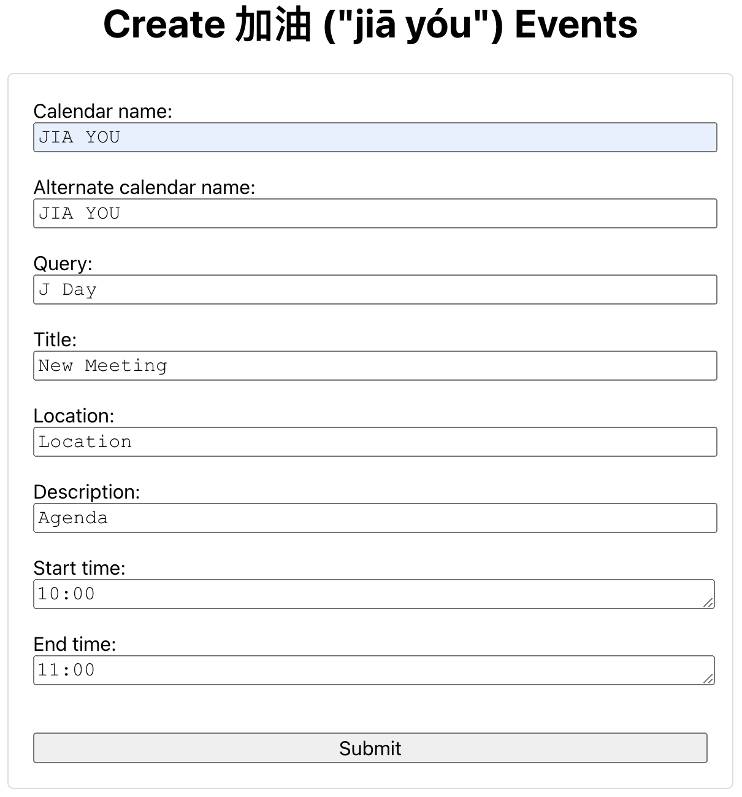
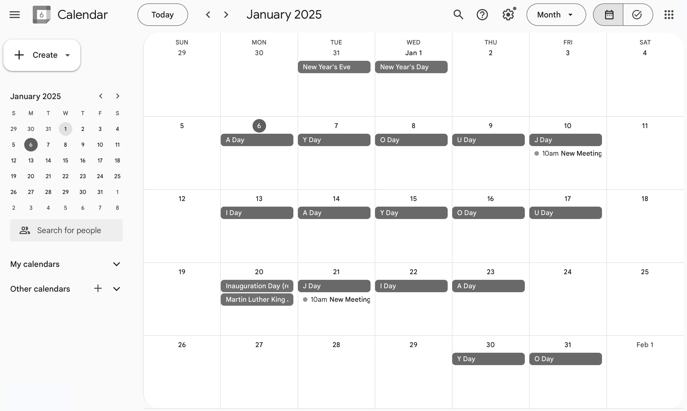

# Add 加油 ("jiā yóu") Events

Google Web app for batch creating additional events on only certain letter days (e.g., on only "J Day's"). Modify as needed, and back up your calendars before you run the app. These events are not recurring events, so without a batch script one would need to add these events manually.

## Visual Example

 Form for creating additional "JIA YOU" events.

 Additional events on only "J Day's" were created.

## Prerequisites

1. Access to [Google Apps Script](https://script.google.com/)
2. 加油 ("jiā yóu") calendar must already exist. If it doesn't, consult the [Web app for creating the calendar](https://github.com/saegl5/jiayou_add_events).

## Getting Started

1. Go to [Google Apps Script](https://script.google.com/), and create a new project.
2. Copy and paste [the script](./Code.gs) into the editor, and save the file.
3. Run the script to acquire authorization.
4. Create an HTML file, and name it "Index."
5. Copy and paste [the markup text](./Index.html) into the editor, and save the file.
6. Deploy the project as a Web app, and open the assigned URL.
7. Modify the calendar name, search query, events' title, guests, location, description, start time, and end time. (**_Must name the calendar differently from the owner name, otherwise the app will not create events._** If you input a URL for the description, text to display will be "Agenda.")
8. Name an alternate calendar to create events on the alternate calendar. (**_Same naming convention applies._**)
9. Confine the date range by inputting a start date and end date.
10. Optionally perform a dry run to test the Web app before running it in production. Consult logs for output.
11. Press submit. (Requires another authorization. **_Note also that creating calendar events is subject to a [use limit](https://support.google.com/a/answer/2905486?hl=en)._**)

## Next Steps

Edit or delete individual events, individual and subsequent events, or all events directly in [Google Calendar](https://calendar.google.com/calendar/).

Additional Web apps are no longer needed. ([Web app for updating events](https://github.com/saegl5/jiayou_update_events) and [Web app for deleting events](https://github.com/saegl5/jiayou_delete_events) have now been deprecated.)

Made with &heartsuit; in Visual Studio Code
