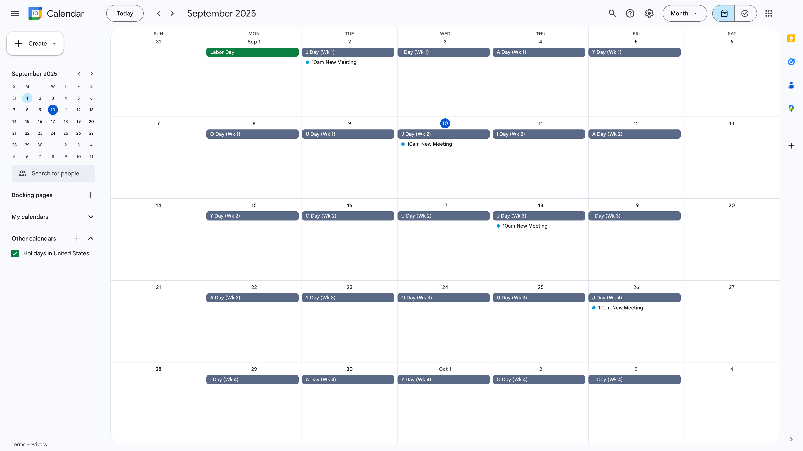

# Add 加油 Events

加油 is a common Chinese expression consisting of two characters, pronounced *jiā yóu* in Mandarin; it is often used as an encouragement.

Add 加油 Events is a Google Web app for creating recurring events on only certain letter days (e.g., on only "J Day's") of a [加油 calendar](https://github.com/saegl5/jiayou_create_calendar). Modify as needed, and back up your calendars before you run the app. Without an app script, one would need to add these events manually.

## Visual Example

<picture>
  <source media="(prefers-color-scheme: dark)" srcset="screenshots/calendarFormDark.png">
  <source media="(prefers-color-scheme: light)" srcset="screenshots/calendarForm.png">
  
</picture>
Form for creating additional "JIA YOU" events. (Username and calendar name are hidden.)  

<picture>
  <source media="(prefers-color-scheme: dark)" srcset="screenshots/calendarDark.png">
  <source media="(prefers-color-scheme: light)" srcset="screenshots/calendar.png">
  
</picture>Additional events on only "J Day's" were created.

## Prerequisites

1. Access to [Google Apps Script](https://script.google.com/)
2. 加油 calendar must already exist. If it doesn't, consult the [Web app for creating the calendar](https://github.com/saegl5/jiayou_create_calendar).

## Getting Started

### Build and Deploy

1. Go to [Google Apps Script](https://script.google.com/), and create a new project.
2. Copy and paste [the script](./Code.gs) into the editor, and save the file.
3. Run the script to acquire authorization.
4. Create an HTML file, and name it "Index."
5. Copy and paste [the markup text](./Index.html) into the editor, and save the file.
6. Repeat steps 4-5 to create [Script.html](./Script.html) and [Style.html](./Style.html)
7. Deploy the project as a Web app, and open the assigned URL.

### How to Use

8. Check the username to ensure that you opened the URL in the correct account.
9. Select the checkbox to view the form in Mandarin.
10. Select your calendar name; choose letter days on which you want to add events, and optionally skip one or two letter days. (The Web app will automatically generate calendars that it can find and select your default one. In the background, it will also automatically locate and hide the 加油 calendar.)
11. Confine the weekly cycle range by modifying the start week and end week. (The Web app will automatically compute the minimum/current start week and maximum end week. If either is empty, events will be added to all chosen letter days within the date range of the collapsible region.)
12. Modify the events' title, start time and end time. (If both times are removed, events will be added as all-day events. For 24-hour time formats, if users input hours of 24 or later it will default hours to 23, for example 24:30 -> 23:30).
13. Expand the collapsible region to modify the events' guests, location, and description. (If you input just a URL for the description, text to display will be "Agenda.")
14. Expand the collapsible region, as well, to confine the date range by modifying the start date and end date. (If either is empty, events will be added to all chosen letter days within the weekly cycle range. If either start week or end week are also empty, events will be added starting either today or ending one year from today.)
15. Optionally perform a dry run to test the Web app before running it in production. Consult logs for output.
16. Press submit. (Requires another authorization. **_Note also that creating recurring events is subject to a [use limit](https://support.google.com/calendar/answer/37115)._**)

## Next Steps

- Edit or delete individual events, individual and subsequent events, or all events directly in [Google Calendar](https://calendar.google.com/calendar/).
- If you deploy the Web app such that it executes as `User accessing the web app` where `Anyone with Google account` can access it, then you can share the URL for them to add events to a calendar in their own account. (You may wish to hide the dry run option.)
- Feel free to fork!
- Additional Web apps are no longer needed. ([Web app for updating events](https://github.com/saegl5/jiayou_update_events) and [Web app for deleting events](https://github.com/saegl5/jiayou_delete_events) have now been deprecated.)

## Known Issues

While you _can_ drag and drop single events of a series to another day or edit the day of a single event of a series, you _cannot_ drag and drop single and subsequent events as a series to another day or edit the day of them all at once. Google Calendar does not handle changing days of these events (i.e., events chained by date) properly. So, treat event days as fixed days. If you need to adjust the events' days, delete the events in Google Calendar, and re-create them using this Web app.

Made with &heartsuit; in Visual Studio Code

 

A special thank you to [James Armstrong](https://github.com/jmarmstrong1207) for adding recurring events, the calendar name dropdown menu, letter day checkboxes, etc.
