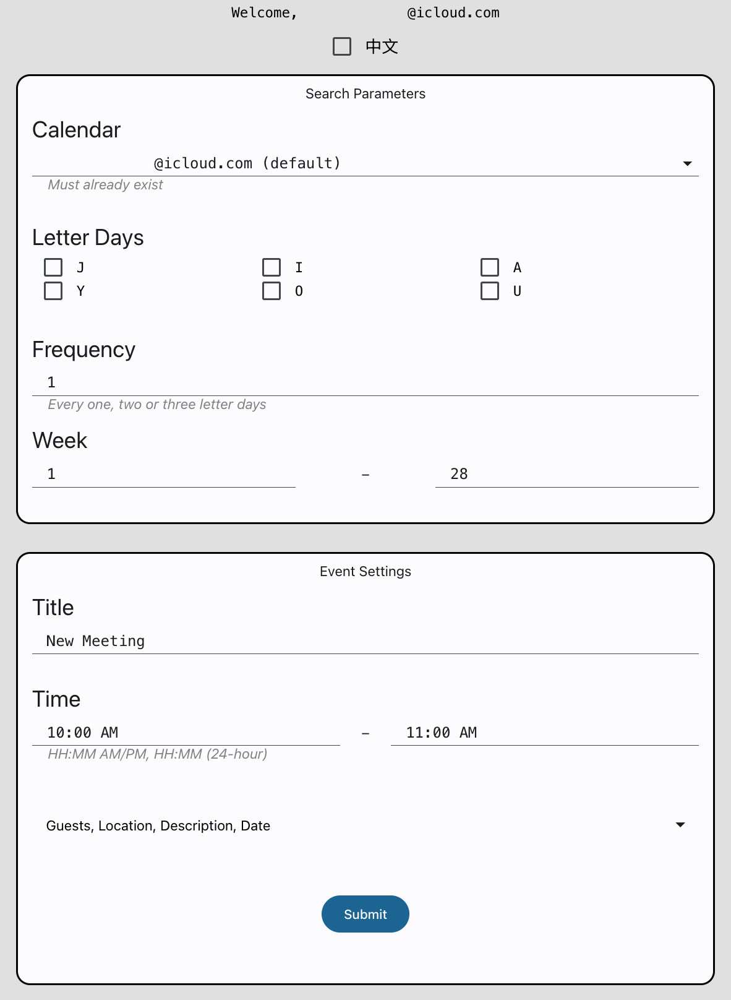

# Add 加油 ("jiā yóu") Events

Google Apps Script for batch creating additional events on only certain letter days (e.g., on only "J Day's"). Modify as needed, and back up your calendars before you run the script. These events are not recurring events, so without a batch script one would need to add these events manually.

## Visual Example

 Form for creating additional "JIA YOU" events.

 Additional events on only "J Day's" were created.

## Getting Started

1. Go to [Google Apps Script](https://script.google.com/), and create a new project.
2. Copy and paste [the script](./Code.gs) into the editor, and save the file.
3. Run the script to acquire authorization.
4. Create an HTML file, and name it "Index."
5. Copy and paste [the markup text](./Index.html) into the editor, and save the file.
6. Deploy the project as a Web app, and open the assigned URL.
7. Modify the calendar name, search query, events' title, location, description, start time, and end time. (***Must name the calendar differently from the owner name, otherwise the script will not create events.***)
8. Name an alternate calendar to create events on the alternate calendar. (***Same naming convention applies.***)
9. Confine the date range by inputting a start date and end date.
10. Press submit. (Requires another authorization. ***Note also that creating calendar events is subject to a [use limit](https://support.google.com/a/answer/2905486?hl=en).***)

Made with &heartsuit; in Visual Studio Code